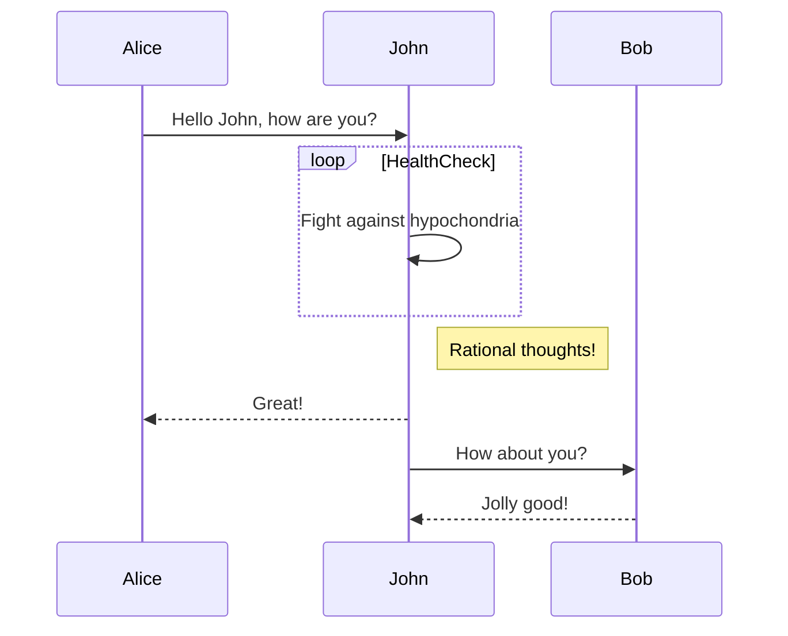
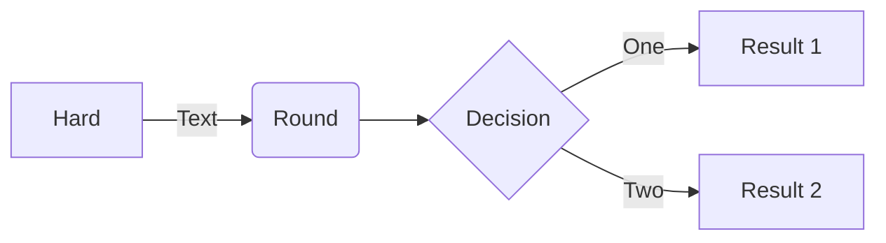

## markdown extension 使い方

### Preview
* view preview: command + k v
* file import: @import "file name"
* ダイヤグラム: mermaid or kurokiが使える
* プレゼン: [公式ドキュメント](https://shd101wyy.github.io/markdown-preview-enhanced/#/ja-jp/presentation)

### All in one
* create table: "Create Table of Content" in command pallet

### mermaid サンプル

